# Parking Slot Management System

## Project Overview
The Smart Park Management System is a web-based application designed to automate and simplify parking management. It allows users to register, book parking slots based on real-time availability, and view their booking history. Administrators can manage parking slots, users, vehicles, and bookings through a dedicated dashboard.

The system supports role-based authentication, real-time slot status updates, booking management, and automated parking fee calculation. It is developed using Java, JSP, Servlets, JDBC, and MySQL, following the MVC architecture to ensure scalability, security, and maintainability.

---

## Tech Stack
- **Frontend:** HTML, CSS, JavaScript  
- **Backend:** Java, JSP, Servlets  
- **Database:** MySQL  
- **Connectivity:** JDBC  
- **Server:** Apache Tomcat  

---

## Features
- User registration and secure login with role-based access (Admin & User)
- Real-time parking slot availability and status tracking
- Online parking slot booking with start and end time selection
- Booking history and current booking status view for users
- Automated parking fee calculation based on duration
- Admin dashboard to manage parking slots, users, vehicles, and bookings
- Dynamic booking status updates (Booked, Active, Completed, Cancelled)
- Secure database integration using JDBC and MySQL
- MVC architecture for better maintainability

---
## Screenshots

### Authentication & Profile
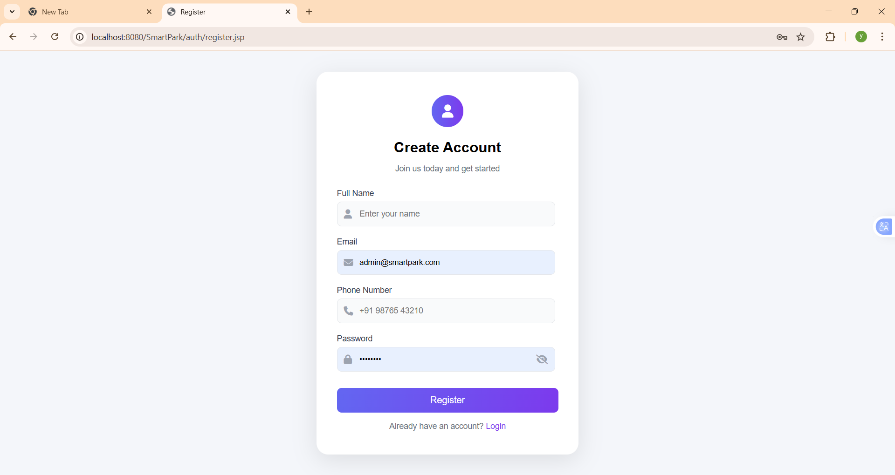

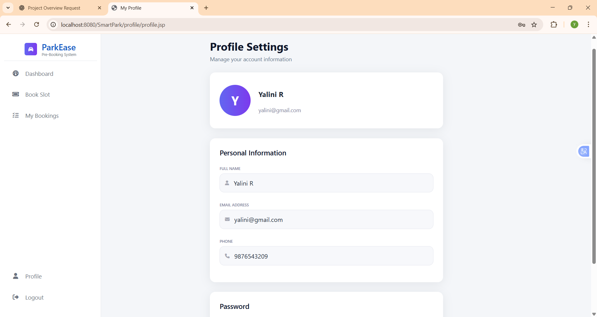

### User View
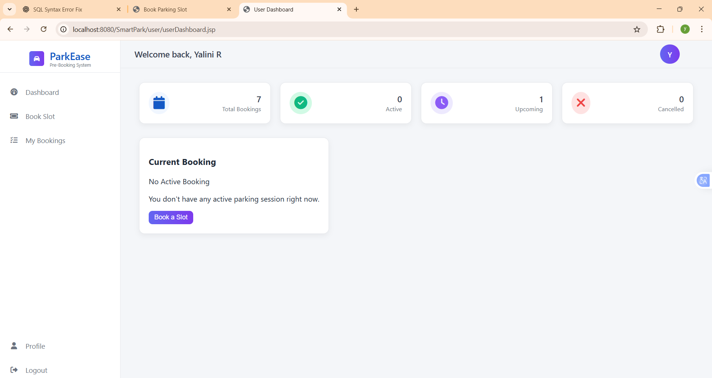
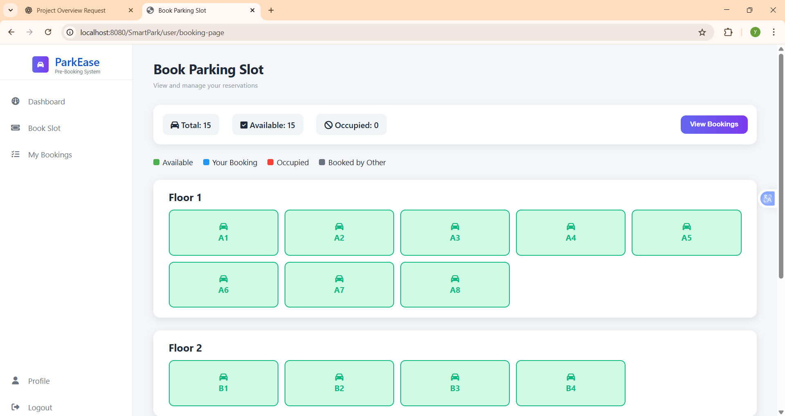
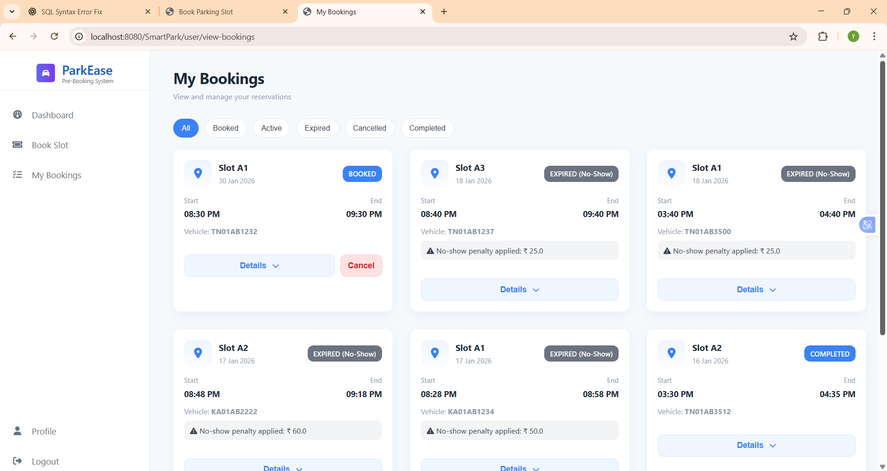

### Admin View
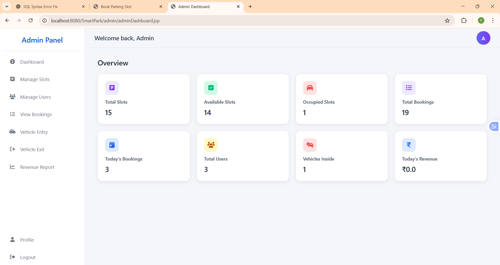
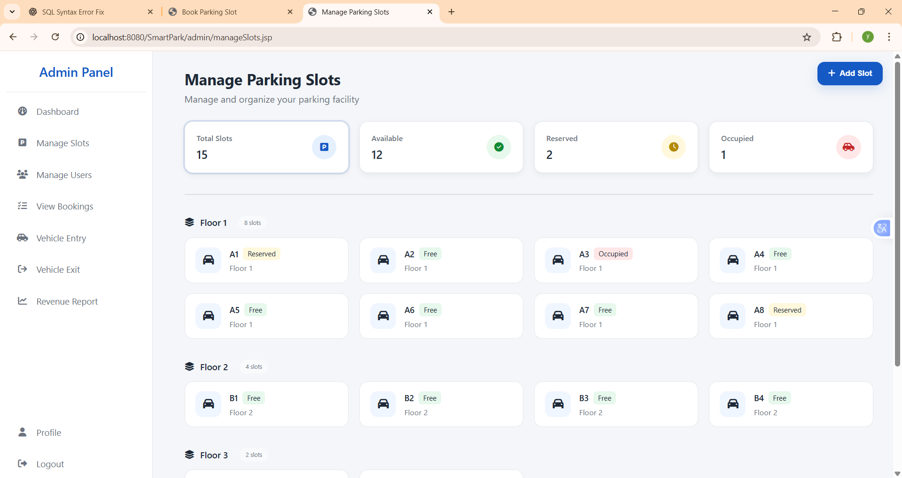
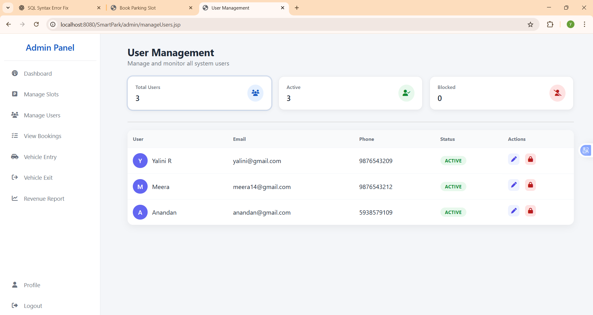
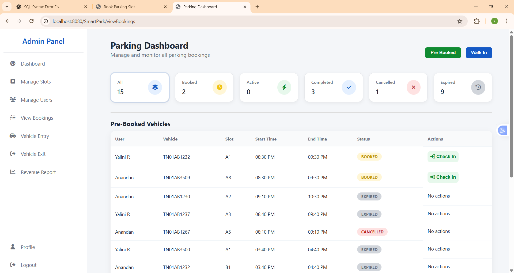
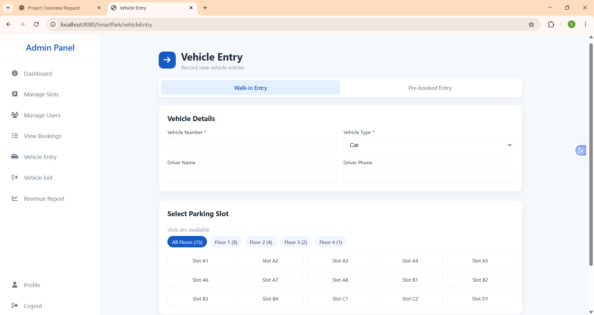
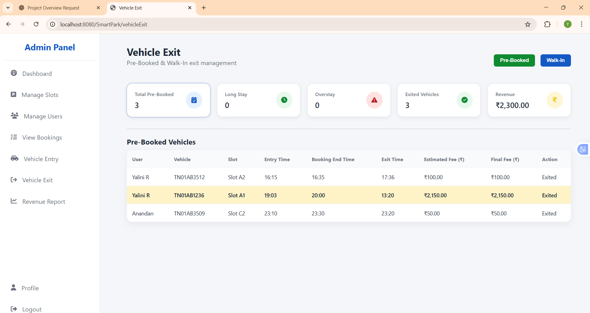
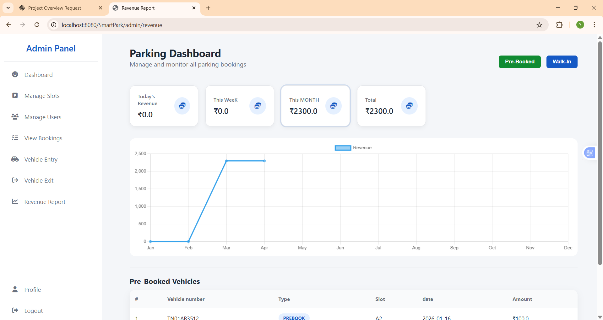

